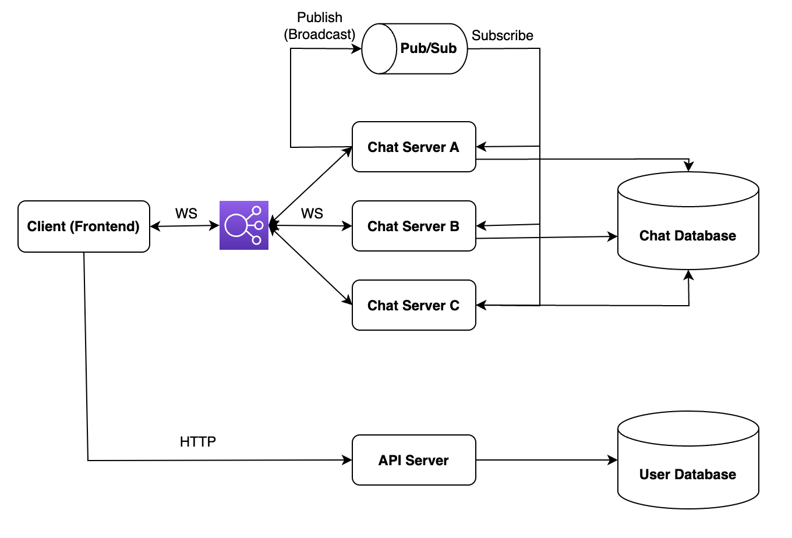

# ChatHub

## About The Project
Implemented a scalable full-stack chat room application that allows real-time group chat and message voting for a 3-day hackathon

### Basic Features
* User account creation (sign in / sign up)
* Chat room info with online member count display
* Group chat
* Upvote/downvote or undo upvote/downvote each message (no multivoting)

### Tech Stack
* **Frontend:** React Javascript
* **Backend:** Go, Gin
* **Protocol:** RESTful API, Websockets
* **Message Queue:** Redis
* **Database:** MongoDB
* **Local Deployment:** Docker
* **Infrastructure:** Minikube

### Tech Features
* Basic password authentication and secure storage
* JSON Web Token for authentication and secure connections
* Horizontally scalable API Server and Chat Server (messaging, upvote/downvote)
* Decoupled API Server and Chat Server

### Software Architecture

<p align="center"> 
    
</p>

**Note:** The Load Balancer is not implemented and is only to show how the Client load can be distributed evenly among Chat Servers, since the Chat Servers are implemented to be able to horizontally scale.

### User Flow
1. The Client will contact the API Server to create a new account in which the new user info will be stored in User Database.
2. The Client will then sign in and retrieve a JSON Web Token (JWT) and Chat Server's server info.
3. Client can then use the JWT and server info to authenticate and establish web socket connection with a Chat Server. 
4. After the Client is connected, the Chat Server will push all the chat history to the Client through the web socket.
5. The Client can now send messages in the chat room.
6. The Chat Server will receive the message, process it, store it in Chat Database, and publish it to the Pub/Sub Redis message channel.
7. All subscribed Chat Servers will receive the message and broadcast it to all the connected Clients through web socket.
8. All online Clients can now either upvote/downvote or undo upvote/downvote the messages in the chat room. 
9. The Chat Server receives the vote, update both the vote count and voter in the database, and publish the updated message.

## Instruction
### Local Run

#### Run docker containers and access at [http://localhost:8080](http://localhost:8080)

```sh
docker compose up
```
### Kubernetes Deployment
1. Create a minikube cluster
   ```sh
   minikube start
   ```
2. Point your shell to minikube's docker-daemon
    ```
    minikube docker-env
    eval $(minikube -p minikube docker-env)
    ```

3. Build and pull your docker images
   ```
   docker compose build
   docker compose pull
   ```
4. Deploy api server, chat server, mongodb, and redis into the minikube cluster
    ```sh
    kubectl apply -f deployment
    ```
